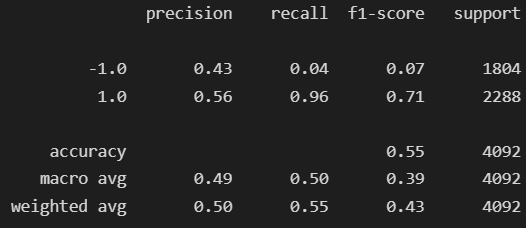
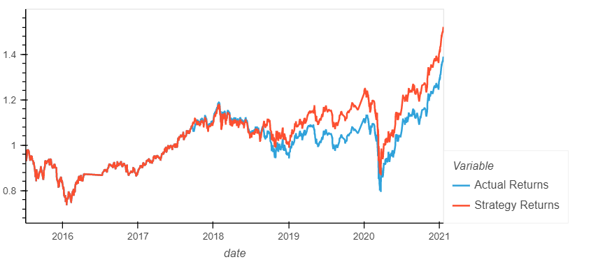
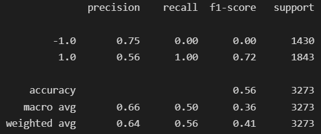
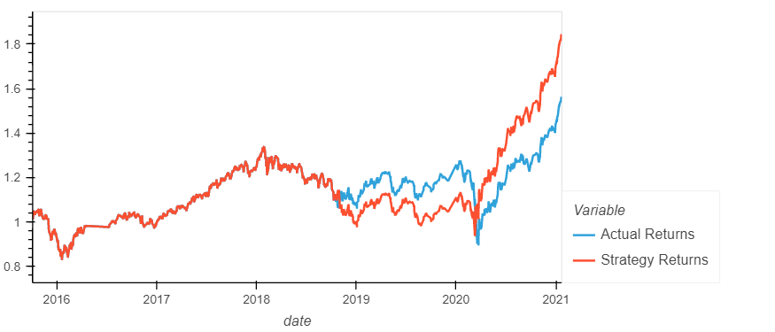
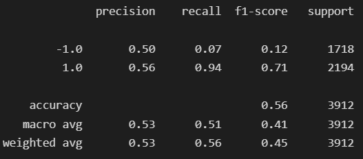
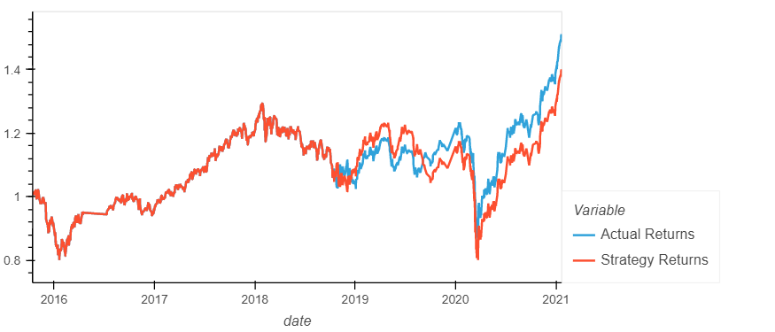
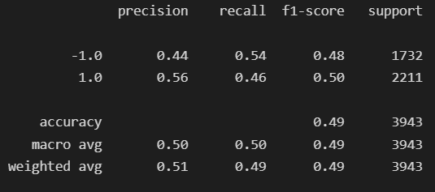

# Machine Learning Trading Bot Application
# Technology:
* Python 3.7
* sklearn machine learning libraries
## Summary:
This application uses machine learning algorithms to automate trades based on the price action history of an unspecified asset. The model evaluates the long term and short term signals or the moving averages for an asset and will give the user input on whether to buy or sell the asset based on those signals. 

## Methodology:
This application accomplishes its goals by first establishing a baseline performance for the given asset if it was "longed" or held for the duration of its movement. We then calculate a short and long moving average for the price of the stock to give us either a "bearish" or "bullish" signal for the stock. This will allow us to make a hypothetical "buy" or "sell" for our asset. We use a support vector machine algorithm to as we train our machine learning model using the short and long signals. We can then evaluate the performance of our model to determine our returns versus our baseline. 
Finally, we introduce another model using a Decision Tree Classifier algorithm as we train our machine learning model.

### SVM Model (Untuned):
* Support Vector Machine Learning model
* Trained on the first 3 months of the data set
* Short signal window of 4 days, long signal window of 100 days

### SVM Model (Tuned):
* Support Vector Machine Learning model
* Trained on the first 6 months of the data set
* Short signal window of 4 days, long signal window of 30 days

# Random Tree Classifier Model
* sklearn Random Tree Classifier model 
* Trained on the first 3 months of the data set
* Short signal window of 4 days, long signal window of 100 days

## Results:
## SVM Model (Untuned)
___
### Classification Report for the SVM Model (Untuned)

### Returns Plot for the SVM model (Untuned) vs Baseline:

## SVM Model (Tuned)
___
### Classification Report for SVM Model (Tuned):

### Returns Plot for the SVM Model (Tuned):

## SVM Model (Long Window)
___
### Classification Report for SVM Model (Long Window):

### Returns Plot for SVM Model (Long Window):

## Alternate Model: Decision Tree Classifier
___
### Classification Report for Alternate Model:

### Returns Plot for the Alternate Model vs. Baseline:

## Conclusion:
The most effective machine learning models were the tuned support vector machine and the long window support vector machine. They both made predictions with a 56% accuracy. 
